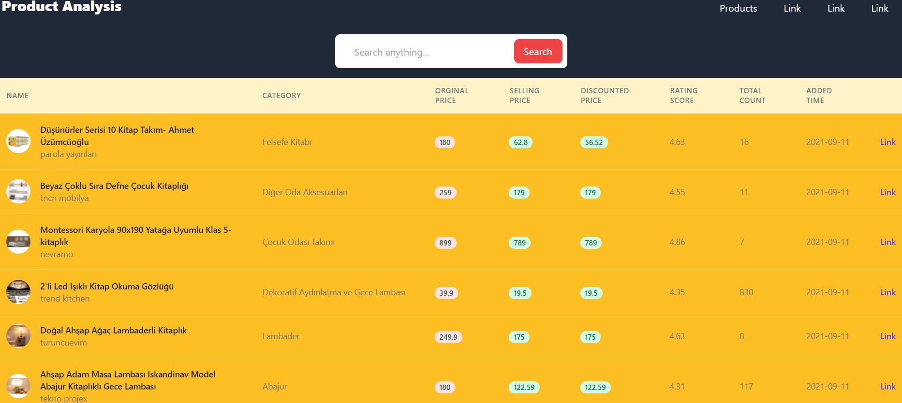

# Product Analysis

My goal in this project is to design a product analysis system using both backend and frontend. I use backAs a stack, I use django on the backend and react on the frontend. I also use multiple databases and Postgresql.
The project is very weak right now and I try to improve it every day.

## Future

In the future, I aim to increase the e-commerce system and details.